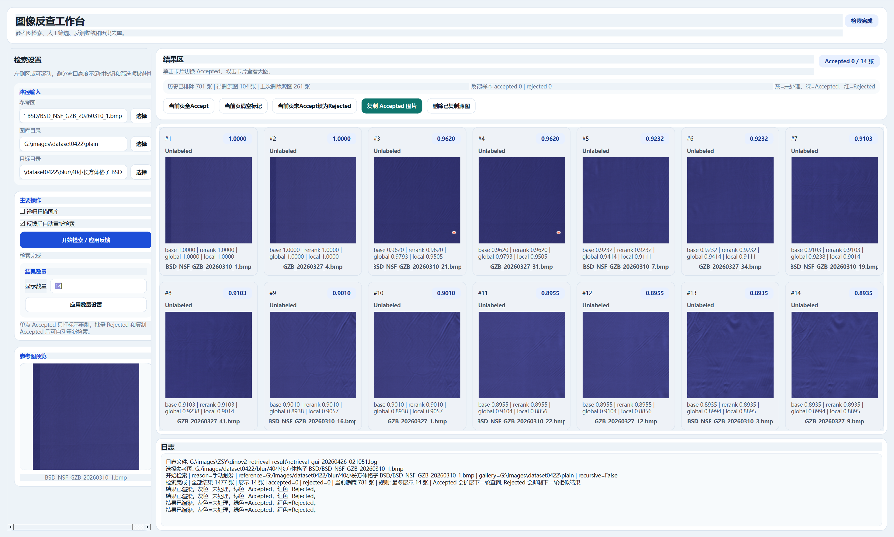

# DINOv2 Fabric Image Workbench

一个基于 DINOv2 的本地图像工作台，围绕“图库检索 -> 人工确认 -> 分类器训练 -> 全图库自动分流 -> 回流训练集”构建。

当前仓库主要包含两条工作流：

- 单张参考图相似检索
- 基于“按类别分文件夹”训练集的分类器训练、预测审核和闭环回流

运行效果如下：



## 当前目录结构

- `main_workbench_gui.py`
  推荐入口，总控 GUI，包含“图片检索”和“训练与自动化”两个页面
- `retrieval_gui.py`
  图片检索 GUI
- `dinov2_patch_retrieval_fast.py`
  检索核心，负责 DINOv2 特征提取、图库缓存、相似度计算和反馈重排
- `dinov2_classifier_common.py`
  分类器闭环共用工具，负责路径归一化、训练特征缓存和图库特征复用
- `train_dinov2_classifier.py`
  使用固定 DINOv2 特征训练线性分类器
- `predict_gallery_with_classifier.py`
  使用分类器对全图库做自动预测，并输出高置信、待审核、未知三类结果
- `run_dinov2_active_loop.py`
  一键执行“训练分类器 -> 预测全图库”
- `cuda_check.py`
  用于快速检查 CUDA 是否可用
- `dinov2_vitb14_pretrain.pth`
  本地 DINOv2 权重文件，不建议提交到 Git

## 环境要求

- Python 3.10+
- PyTorch
- torchvision
- pandas
- Pillow
- PySide6
- tqdm

如需启用 GPU，请确保本机 CUDA 环境和当前 PyTorch 版本匹配。

## 启动方式

推荐直接启动总控 GUI：

```bash
python main_workbench_gui.py
```

主界面包含：

1. `界面一：图片检索`
2. `界面二：训练与自动化`

如果只想使用检索界面：

```bash
python retrieval_gui.py
```

如果只想跑分类器闭环脚本：

```bash
python run_dinov2_active_loop.py
```

也可以分步执行：

```bash
python train_dinov2_classifier.py
python predict_gallery_with_classifier.py
```

如果只是检查 CUDA：

```bash
python cuda_check.py
```

## 配置入口

检索链路主要配置在 `dinov2_patch_retrieval_fast.py` 顶部：

- `reference_image_path`
- `gallery_dir`
- `gallery_recursive`
- `output_dir`
- `feature_cache_dir`
- `local_pretrained_path`

分类器闭环主要配置在：

- `train_dinov2_classifier.py`
- `predict_gallery_with_classifier.py`

GUI 中的“训练与自动化”页默认展示基础工作流参数，更多参数位于“高级设置”：

- 输出目录
- 特征缓存目录
- DINOv2 模型权重路径
- 训练参数
- 预测阈值

## 图片检索流程

1. 选择参考图、图库目录和输出目录。
2. 点击“开始检索 / 应用反馈”。
3. 将正确结果标记为 `Accepted`，不需要的结果标为 `Rejected`。
4. 点击“复制 Accepted 图片”，把确认结果复制到输出目录。
5. 复制后的源图会在后续检索中被排除，便于继续查漏。
6. 确认这一批已处理完成后，可删除图库中的已复制源图。

## 分类器闭环流程

这条链路适合已经有基础类别结构、希望持续人工扩张训练集的场景：

1. 准备一个“按类别分文件夹”的训练数据集目录。
2. 用 DINOv2 固定特征训练线性分类器。
3. 对全图库进行自动分类。
4. 将结果拆分为：
   - `high_confidence_candidate`
   - `review`
   - `unknown`
5. 在 `界面二：训练与自动化` 中审核预测结果。
6. 将确认通过的图片加入 `final_result_pool.csv`。
7. 再把这些图片直接移动到训练数据集目录对应类别，作为下一轮训练样本。

训练集目录组织方式示例：

```text
dataset_root/
  class_a/
    001.jpg
    002.jpg
  class_b/
    001.jpg
    002.jpg
```

## 缓存机制说明

当前实现了两层缓存，目的是减少重复特征提取：

- 训练特征缓存
  当审核通过的图片被移动到训练集目录时，GUI 会同步保存这张图的训练特征，下次重训会直接复用。
- 图库特征缓存
  图库特征除了保留原有整库缓存外，还新增了“按图片签名”的增量缓存。

这意味着：

- 第一次跑某个图库时，仍然需要完整提取一次图库特征。
- 后续如果只是把少量图片从图库移动进训练集，或者图库只新增/变更了少量图片，不会再整库重建。
- 系统会优先复用未变化图片的缓存特征，只对新增、修改或缺失的图片补提特征。

你会在日志中看到类似输出：

- `读取图库增量特征缓存`
- `图库增量缓存命中 198/201，开始补提 3 张图片特征...`
- `图库增量缓存全命中，直接复用 ...`

## 主要输出文件

默认输出目录 `dinov2_retrieval_result/` 下通常会生成：

- `summary.txt`
- `retrieval_gui_*.log`
- `classifier_pipeline/folder_dataset_manifest.csv`
- `classifier_pipeline/dinov2_linear_classifier.pt`
- `classifier_pipeline/training_history.csv`
- `classifier_pipeline/prediction_all.csv`
- `classifier_pipeline/prediction_high_confidence_candidate.csv`
- `classifier_pipeline/prediction_review_queue.csv`
- `classifier_pipeline/prediction_unknown.csv`
- `classifier_pipeline/prediction_review_feedback.csv`
- `classifier_pipeline/final_result_pool.csv`
- `feature_cache/gallery_features_fast_*.pt`
- `feature_cache/gallery_feature_items_*.pt`

这些都属于本地运行产物，默认不会提交到 Git。

## Git 说明

仓库已通过 `.gitignore` 忽略以下本地产物：

- `__pycache__/`
- `.vscode/`
- `dinov2_retrieval_result/`
- `*.pth`

建议只提交源码、说明文档和必要资源，不提交模型权重、缓存、日志和预测输出。
